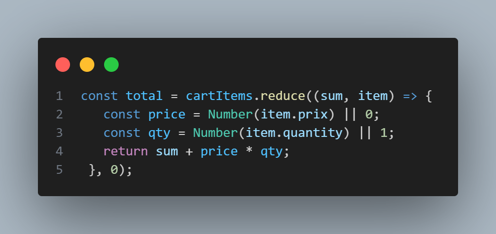
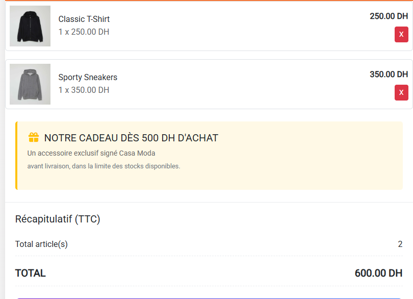
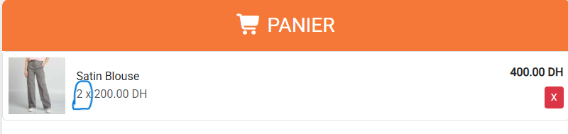
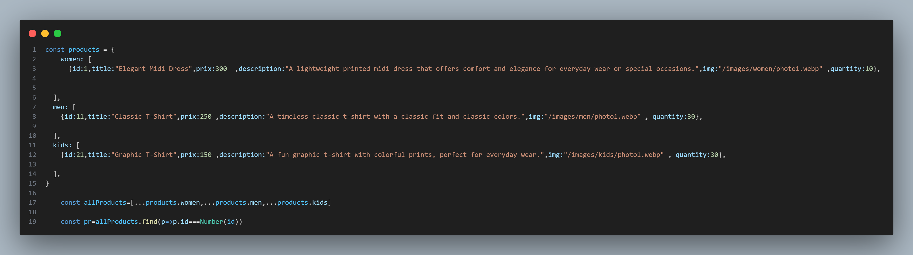
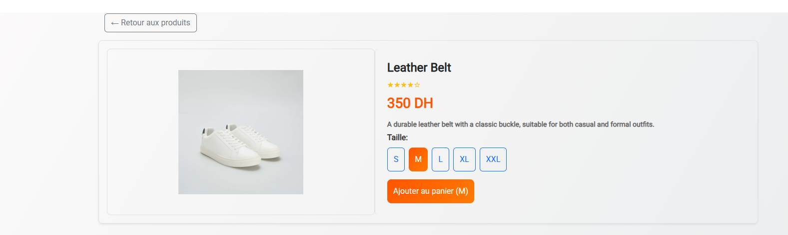
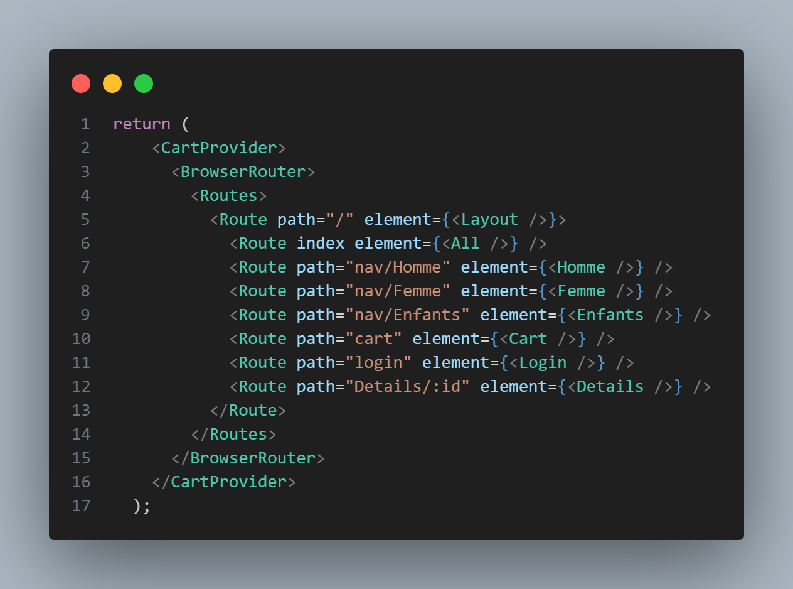

# CASA MODA - E-commerce React
## 📋 Table des Matières
- [Aperçu du Projet](#aperçu-du-projet)
- [Architecture Technique](#architecture-technique)
- [Fonctionnalités Détaillées](#fonctionnalités-détaillées)
- [Structure des Composants](#structure-des-composants)
- [Gestion d'État](#gestion-détat)
- [Guide d'Installation](#guide-dinstallation)

---

## Aperçu du Projet

**CASA MODA** est une mini-boutique construite avec **React**.  
Cette application permet aux utilisateurs de parcourir les produits pour hommes, femmes et enfants, de consulter les détails, d’ajouter des articles au panier .

🔗 **Live Demo :** [https://casamoda07.netlify.app/](https://casamoda07.netlify.app/)


---

### Objectifs principaux
* - Créer une interface web **simple, fluide et responsive** pour la vente de produits.
* - Mettre en pratique les concepts clés de **React** :
*  - Gestion globale de l’état avec **Context API**
*  - Navigation entre pages avec **React Router**
*  - Implémenter un panier fonctionnel :
*  - Ajouter et supprimer des produits
*  - Calcul automatique du total

---

## Architecture Technique
- **Frontend**: React  avec Hooks et Context API
- **Routing**: React Router pour la navigation SPA
- **Styling**: Bootstrap  + CSS personnalisé
- **Images**: Format WebP pour l'optimisation
- **State Management**: Context API pour l'état global

---

## Fonctionnalités Détaillées
- Catalogue de produits divisé par catégories : Homme, Femme, Enfants
- Détails des produits avec image, description, prix et choix de taille
- Panier interactif :
  - Ajout/suppression de produits
  - Calcul du total en temps réel
- Section paiement simulée avec informations de carte
- Login / Signup (connexion et inscription)
- Navigation responsive avec menu mobile
- Vidéo promotionnelle en page d'accueil
- Footer informatif avec réseaux sociaux et liens utiles

---

### Technologies utilisées
- **React** (JSX, Hooks, Context API)
- **React Router** pour la navigation
- **Bootstrap** & **Bootstrap Icons**
- **CSS personnalisé** pour le design
- **WebP images** pour optimiser le chargement

---


---

## Structure des Composants

### CartContext 

  

---
      const [cartItems, setCartItems] = useState([]);
      const addToCart = (product) => {
      setCartItems((prev) => {
      const existing = prev.find((item) => item.id === product.id);
      if (existing) {
      
      return prev.map((item) =>
          item.id === product.id
            ? { ...item, quantity: (item.quantity || 1) + 1 }
            : item
        );
      } else {
        
        return [...prev, { ...product, quantity: 1 }];
      }

      
    });
  };


* cartItems   est le tableau contenant tous les produits dans le panier.
Si le produit est déjà dans le panier, la quantité augmente de 1.
Sinon, le produit est ajouté avec quantity = 1. 
---
---
[](image-5.png)
---


## Navbar


[](image-9.png)

- La **barre de navigation** contient toutes les catégories :  
  - **Homme**  
  - **Femme**  
  - **Enfants**  

- Les utilisateurs peuvent **cliquer sur chaque catégorie** pour voir uniquement les produits correspondants.  

- Une **barre de recherche** permet de filtrer les produits en temps réel par titre .  

- Le Navbar est **responsive** :
  - Menu mobile pour petits écrans  
  - Design clair et intuitif pour la navigation sur tous les devices


---
### cart.jsx 
[](image-2.png)


**Cette ligne calcule le total du panier : elle parcourt tous les produits (cartItems), multiplie le prix (prix) par la quantité (quantity) pour chaque produit, puis additionne le tout pour obtenir le total**


[](image-11.png)


---
---
[](image.png)
* L’utilisateur voit tous les produits ajoutés au panier.
* Il peut consulter la quantité, le prix et le sous-total de chaque produit.
* Il peut supprimer facilement n’importe quel produit.
* L’affichage est clair et esthétique grâce aux classes Bootstrap.

[](image-6.png)

---
### Gestion des Produits 

[](image-10.png)
* On combine d’abord tous les produits dans un seul tableau, puis on peut facilement retrouver n’importe quel produit selon son id pour l’afficher dans la page de détails.

* Permet de trouver un produit précis selon son id, utile pour afficher les détails d’un produit sur la page Details/:id


[](image-7.png)

--- 
## Gestion d'État

### Projets.jsx 
[](image-3.png)

* Layout : Le composant principal qui contient l’en-tête, l’espace pour afficher le contenu selon la route.
* All : Page affichant tous les produits.
* Homme, Femme, Enfants : Pages affichant les      produits par catégorie.
* Cart : Page du panier avec la liste des produits ajoutés.
* Login : Page de connexion de l’utilisateur. --Details/:id : Page affichant les détails d’un produit spécifique selon son ID

* CartProvider :  est le composant qui englobe toute l’application pour fournir ce contexte à tous les composants enfants. rend l’état du panier et les fonctions pour ajouter ou supprimer des produits accessibles depuis n’importe quel composant de l’application.


---

## Guide d'Installation

```bash
# Cloner le repository
git clone https://github.com/Aymanelasri/e-commerce22.git

# Installer les dépendances
npm install

# Lancer l'application
npm start
```

---

## 👥 Contributeurs

- **Développeur Principal** : Ayman Elasri
